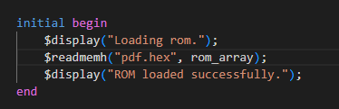
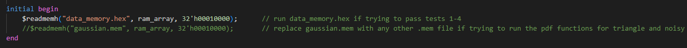
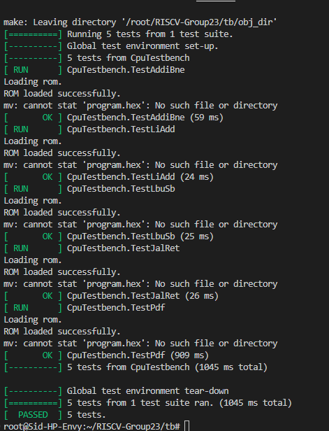

# RISCV-Group23

## Joint Statement and Structure

This repo contains all components, testing and results for the RV32I single-cycle processor and the RV32I pipelined processor with cache, as well as videos of the functional tests on the Vbuddy. It also contains a log of what tasks each of us completed on what days and everyone also has their personal statements, which can be seen in the table below:

| Name       | CID | Link to Logbook | Personal Statement |
|------------|--------|-----|------|
| Akarsh Gopalam     | 02395592       |   [Akarsh's Log](./docs/logs/Akarsh_log.md)  |   [Akarsh's Personal Statement](./docs/Akarsh_Personal_Statement.md)   |
| Lucas Venetez     |  02387237 |  [Lucas's Log](./docs/logs/Lucas_log.md)    |   |  [Lucas' Personal Statement](./docs/Lucas_Personal_Statement.md) |
| Siddharth Mishra   |    02382743    |   [Sid's Log](./docs/logs/Sid_log.md)   |  [Sid's Personal Statement](./docs/Siddharth_Personal_Statement.md)  |
| Theodore Shah     |  02380127      |  [Theo's Log](./docs/logs/Theo_log.md)    |    |

</br>

There are 3 branches of interest:
- ```main``` is the current branch which contains the fully functional and verified pipelined processor with hazard handling, 2-way cache and a 2 bit counter branch prediction unit (in the ```rtl``` folder). To run this, ***the newest version of Verilator MUST be downloaded (Version 5.031)***, otherwise it will not function as intended. There are verilator errors that stop the cache from being built in the verilator version we installed in Lab0 (Version 4.xx). This design choice was made unintentionally as Lucas, responsible for the design of the cache, had to install this version of verilator earlier on in the academic year due to being unable to install the Lab0 older version of verilator. We have provided videos and images of the results of the tests to prove the functionality of our CPU. The most recent version of verilator can be found here: https://verilator.org/guide/latest/install.html, in which we did a "Git quick install". After updating our verilators to match Lucas's, we were able to use verilator to build the cache and the CPU without errors. 
  This branch also contains instructions in this README.md document on how to: run the tests, including F1 and pdf. It also contains videos of these working and a brief explanation of the assembly code, the contributions table and a brief outline of which components were made by who and how they work (although more details of these can be found in our personal statements and logbooks in this branch). It also contains screenshots of simulations and videos located in the ```Test_Results``` folder and a ```tb``` folder with the assembly files and the ```./doit.sh``` script to run Tests 1-5. ```docs``` also contains our logbooks and our personal statements. 
- ```final_pipeline``` contains the fully functional and verified pipelined processor with hazard handling (including a branch prediction unit). This branch contains a folder called rtl_pipelining which can be run and verified, and it will work on the older version of Verilator as well as the new one. <a href="https://github.com/luqeei1/RISCV-Group23/tree/final_pipeline"> This can be found here </a>
- ```final_single_cycle```  contains the fully functional and verified single-cycle processor and contains a folder called rtl_single_cycle which can be run and verified. It will work on the older version of Verilator as well as the new one. <a href="https://github.com/luqeei1/RISCV-Group23/tree/final_single_cycle">This can be accessed here<a/>

There are also other branches, which were primarily made for debugging and testing purposes when trying to implement pipelining and cache, but only the above 3 are to be assessed properly.

Note that debugging was often done as a group with multiple people working on a single laptop, so some people's work may be committed through another person's laptop. Work was evenly divided among the group but everybody contributed to debugging and this often meant making edits to files that we didn't contribute directly to. 


<br />

## IMPORTANT: HOW TO RUN THE SCRIPTS (read this before running any scripts !)

To run scripts on the ```main``` branch (which contains the functional pipelined processor with two-way cache and a branch prediction unit), you need to upgrade to the **latest version** of Verilator, which is ```Verilator 5.0231```. 

Please connect Vbuddy using the following command:

```
~/Documents/iac/lab0-devtools/tools/attach_usb.sh
```
These instructions are suitable if running from Windows. the first command should connect the Vbuddy, and the second command lets you know what the name of the port that Vbuddy is connected to. if this is different from the ```vbuddy.cfg``` file, then update this and check the name via: 

```
ls /dev/ttyU*
```

### Running the Tests 1-5

Use ``` cd tb ``` to make sure you are in the ``` tb ``` directory and run the script as follows:

```
./doit.sh
```

make sure that ``` data_memory.sv ``` contains ``` data_memory.hex ``` and that ```instruction_memory.sv ``` contains ```pdf.hex```. 


This can be repeated for all versions of our RISCV-32I CPU. 

<br />

<br />

## RV32I Single-Cycle Design

### Task Allocation

We met up as a team and based on the tasks we had each done during Lab4, we decided to split up our tasks for the single-processor as follows:

| Component       | Akarsh | Sid | Theo | Lucas |
|------------|--------|-----|------|-------|
| alu.sv     |        |  M   |      |       |
| data_memory.sv     |  M |     |      |       |
| program_counter.sv   |        |     |      |    M   |
| instruction_memory.sv     |    P    |  P   |    M  |       |
| regfile.sv     |   P     |   M  |      |       |
| ALUDecoder.sv     |        |     |   M   |    P   |
| controlUnit.sv     |        |  P   |   M   |       |
| signExtend.sv     |        |     |    M  |       |
| mux3.sv     |        |     |      |    M   |
| top.sv     |   P    |  M  |  P   |    P   |


M - Main Contributor
P - Partial Contributor

## RV32I Pipelined Design

| Component       | Akarsh | Sid | Theo | Lucas |
|------------|--------|-----|------|-------|
| ALU     |        |  M   |      |       |
| Data Memory     |  M |     |      |   P    |
| Program Counter   |        |     |      |    M   |
| Instruction Memory     |    P    |  P   |    M  |       |
| Sign Extend     |        |     |   M   |       |
| Register File     |   P     |   M  |      |       |
| Control Unit     |        |  P   |   M   |   P    |
| Top (single-cycle)     |   P    |  M  |  P   |    P   |
| Branch Prediction     |       |  P  |  M  |       |
| Pipeline Flip Flops     |       |  P  |  M  |    P   |
| Hazard Unit     |       |  P  |  P  |   M    |
| Cache     |       |    |  P  |   M    |
| Top (pipelining)     |   P    |  P  |     |   M    |


M - Main Contributor
P - Partial Contributor

<br />

### Creating the F1.s assembly code

The brief required us to implement the F1 starting light algorithm from Lab 3 in the RV32I instruction set, with the condition that we must use a ```jal``` instruction because at least one subroutine was to be implemented.
We also added a random delay interval between lights and adding a trigger everytime the lights reset. Below are the registers used:

| Register       | Function |
|------------|--------|
| ```a0```     |   Tracking overall system state (```0``` if waiting, ```1``` if active)     |
| ```a1```      |  Holds the current LED pattern (initialised with arbitrarily chosen ```0xABC```) |
| ```a2```      |  Stores intermediate results in ```led_sequence``` |
| ```a3```      |  Stores the delay count in ```delay_subroutine``` and temporarily holds shifted bits after XOR operations in ```led_sequence```  |
| ```a4```    |    Holds the stopping pattern (```0xFF```)    |
| ```a5```      |  Checks the trigger condition in ```wait_trigger``` |
| ```t0```      |  Temporary register while ```a0``` is updated with new states |
| ```ra```      |  Special register holding return address after subroutine is called |

Broadly speaking, the program:

- waits for a trigger (connected to ```0x100```)
- If triggered, starts the sequence of LEDs and checks at each updated pattern if the current pattern was equal to the target stopping pattern held in ```a4 ``` using a ```beq``` instruction.
- If equal, the pattern would be completed and the program would wait for another trigger. In between every LED sequence, a pseudo-random delay has been incorporated

The delay has been "randomised" through a simple LFSR process, with an initial seed of ```0xABC``` being modified repeatedly using shifts and XOR operations, with the new value used to determine the delay before turning on the subsequent LED. We limited the range of delay by only extracting the lower 5 bits, allowing us to keep any delays reasonable. 

Screenshots of waveforms showing the working F1.s script and specific signals can be viewed [here](./Test_Results/Images/F1_single_cycle). Also can be referenced in Siddharth's personal statement. To run this script, enter ```./F1.sh``` into the terminal, and ensure that ```instruction_memory.sv``` is reading from ```InstructionFiles/F1.hex``` andd ```data_memory.sv``` is reading from ```data_memory.hex```.

### Testing the probability density function tests

There were three files: gaussian.mem, noisy.mem, and triangle.mem , which could be run by running the ```./pdf.sh``` command on terminal, ensuring it was being tested via the ```pdfgen_tb.cpp``` testbench. We ensured that the pdf would plot very fast, we decided to ignore when a0 was zero. This change was made in the test bench. The full explanation can be found in Akarsh's logbook. Videos can be shown below.

To run the pdf functions, ensure that ```instruction_memory.sv``` is always reading from ```pdf.hex```. Depending on which function you want plotted, update the contents of ```data_memory.sv``` to read either ```MemoryFiles/gaussian.mem```, ```MemoryFiles/noisy.mem``` or ```MemoryFiles/triangle.mem``` . Take care to note that you are reading from the correct folder and have this path, not just the file name. 

### F1 Lights (Single Cycle)

[](https://www.youtube.com/watch?v=kvJkfpa182A)

### F1 Lights (Pipelined)

[](https://www.youtube.com/watch?v=hqBxMIpIb7w)

### Triangle PDF

[](https://www.youtube.com/watch?v=jg93zmgKeUM)

### Noisy PDF

[](https://www.youtube.com/watch?v=Xb7KfGf_f7Y)

### Gaussian PDF

[](https://www.youtube.com/watch?v=1BHme1be_hA)


### Tests 1-5:

Running Tests 1-5 can be done by running the ```./doit.sh``` script after navigating to the ```tb``` directory, and modifying ```instruction_memory.sv``` in the lines shown so that ```pdf.hex``` is the file that is being read.


<div align = "centre">
   </img>
</div>

Then modify ```data_memory.sv``` as shown:

<div align = "centre">
   </img>
</div>

The results should be as follows:

<div align = "centre">
   </img>
</div>

It is clear from this that all test cases should be passed, and this should work regardless of whether you are trying to test the single-cycle, pipelined (without cache) and the main pipelined, cached processor (the one in the ```rtl``` folder in this branch). 

